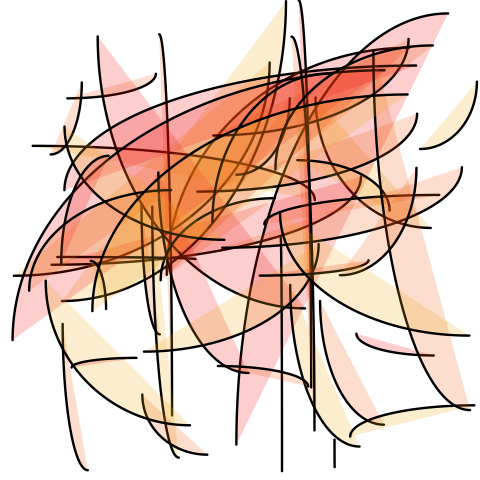

# solandra-svg

Solandra is a declarative, fluent, concise, type-safe SVG drawing library.

You can use it to create dynamic or static generative graphics for use on the web or via other JavaScript runtimes.

- [Try out](https://codesandbox.io/s/simple-solandra-svg-demo-obinl)
- [Site](https://solandra-svg.netlify.app/)
- [Install](https://www.npmjs.com/package/solandra-svg)

## Example

```typescript
s.times(25, () => {
  s.strokedPath((attr) => attr.fill(20, 90, 50, 0.2))
    .moveTo(s.randomPoint())
    .arcTo(s.randomPoint())
})
```



## For LLMs

This repo contains a `llm.md` file that can be used to provide context to a Large Language Model. It contains a markdown description of solandra-svg along with annotated code examples and a tutorial based on examples within/used by `src/pages`.

[LLM Documentation](./llm.md)

## Updates

### 0.5.1

- Minor typo fixes and updated documentation on using with AIs.

### 0.5.0

- OkLCH
- Regular Polygon helper
- more convenient APIs: `A` and `T` for concise Attributes and Transforms
- tweaks

### 0.4.0

- `groupWithId` to easily build out groups in SVGs (where you only care about logically separating)
- `cutPath` and `creasePath` for convenient paths for cut and fold patterns
- `randomAngle`
- `transformOrigin` attribute (so can easily rotate things)

## To develop or run locally

First, run the development server:

```bash
pnpm i
pnpm start
```

Should open browser.

## History

Core, relevant bits of Solandra applied to SVG for static renders. Include html-ish stuff like classes, ids. Do groups, layers, ...

Don't do fill/draw separately (as Solandra)

Main short term goal is for plotting type stuff.

Keep it minimal

Output in various ways: initial focus preview/sketch-book + svg file (or something equiv)

Probably just support svg, path and g(roup)

## TO DO/Roadmap

- [x] Basics
- [x] Transforms
- [x] Arcs (within path)
- [x] Ellipse (as move, arc)
- [x] Custom path transform (i.e. user supplied function to transform; at least points, maybe other aspects of path spec?)
- [x] Chaikin
- [x] clone path
- [x] squash commits(!), publish to npm, open source

### Post v'0.1'

- [x] Inkscape friendly export (dimensions, colours, ...?)
- [x] Groups (have plans for closure based approach for nesting)
- [x] Quick website update (animated transitions, links to source code (but keep very simple, raw GH nothing embedded(!)))

### After

- [x] Object literal apis for attributes and transforms

### Next gen

- [x] Vite
- [x] get deploying
- [x] new lib stuff for cut and fold
- [x] cut and fold example

## API

## Publishing

`pnpm build:package`

`cd package`

`npm publish`
