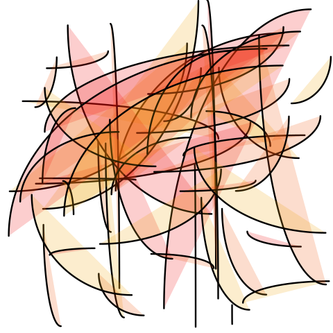

# solandra-svg

Solandra is a declarative, fluent, concise, type-safe SVG drawing library.

You can use it to create dynamic or static generative graphics for use on the web or via other JavaScript runtimes.

- [Try out](https://codesandbox.io/s/simple-solandra-svg-demo-obinl)
- [Site](https://solandra-svg.netlify.app/)
- [Install](https://www.npmjs.com/package/solandra-svg)

## Example

```typescript
s.times(25, () => {
  s.strokedPath((attr) => attr.fill(20, 90, 50, 0.2))
    .moveTo(s.randomPoint())
    .arcTo(s.randomPoint())
})
```



## For LLMs

This repo contains a `llm.md` file that can be used to provide context to a Large Language Model. It contains a markdown description of solandra-svg along with annotated code examples and a tutorial based on examples within/used by `src/pages`.

[LLM Documentation](./llm.md)

## Updates

See [CHANGELOG.md](./CHANGELOG.md) for the full release history.

## To develop or run locally

First, run the development server:

```bash
pnpm i
pnpm start
```

Should open browser.

To run the checks used in CI:

```bash
pnpm test --run   # unit tests
pnpm lint         # type-aware linting
pnpm verify:package  # build and smoke-test the publishable package
```

## Design

Solandra-SVG applies the core, relevant bits of [Solandra](https://github.com/jamesporter/solandra) to SVG for static renders. It supports HTML-ish concepts (classes, ids), groups and layers, and focuses on generative art and pen-plotting workflows. Output is an SVG string (or data URI) suitable for the browser, a sketchbook preview, or an `.svg` file.

## Publishing

```bash
pnpm build:package  # generates ./package
pnpm verify:package # smoke-test the built ESM + CJS artifacts
cd package
npm publish
```
